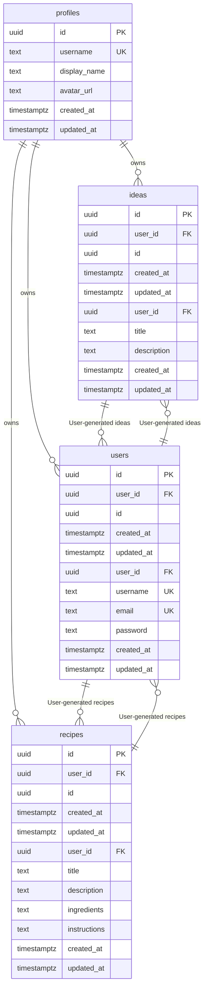

# Entity Relationship Diagram - ForagePro

> **Auto-generated** from your idea analysis
> **Entities:** 3

---

## Visual Diagram

---

## Entity Details

### Idea
> User-generated ideas for wild food recipes, foraging techniques, or sustainable practices

**Fields:**
  - `id`: uuid (required) - Primary key
  - `created_at`: datetime (required) - Creation timestamp
  - `updated_at`: datetime (required) - Last update timestamp
  - `user_id`: uuid (required) - Owner user ID
  - `title`: string (required)
  - `description`: text (required)

**Relationships:**
  - one_to_many → **User**: User-generated ideas

### User
> ForageHub users, including enthusiasts, experts, and suppliers

**Fields:**
  - `id`: uuid (required) - Primary key
  - `created_at`: datetime (required) - Creation timestamp
  - `updated_at`: datetime (required) - Last update timestamp
  - `user_id`: uuid (required) - Owner user ID
  - `username`: string (required, unique)
  - `email`: string (required, unique)
  - `password`: string (required)

**Relationships:**
  - one_to_many → **Idea**: User-generated ideas
  - one_to_many → **Recipe**: User-generated recipes

### Recipe
> Wild food recipes shared by users

**Fields:**
  - `id`: uuid (required) - Primary key
  - `created_at`: datetime (required) - Creation timestamp
  - `updated_at`: datetime (required) - Last update timestamp
  - `user_id`: uuid (required) - Owner user ID
  - `title`: string (required)
  - `description`: text (required)
  - `ingredients`: text (required)
  - `instructions`: text (required)

**Relationships:**
  - one_to_many → **User**: User-generated recipes

---

## Notes

- All entities have standard fields: `id`, `user_id`, `created_at`, `updated_at`
- `PK` = Primary Key, `FK` = Foreign Key, `UK` = Unique Key
- Copy the Mermaid code block to visualize in any Mermaid-compatible tool
- Relationships: `||--o{` = one-to-many, `||--||` = one-to-one, `}o--o{` = many-to-many
